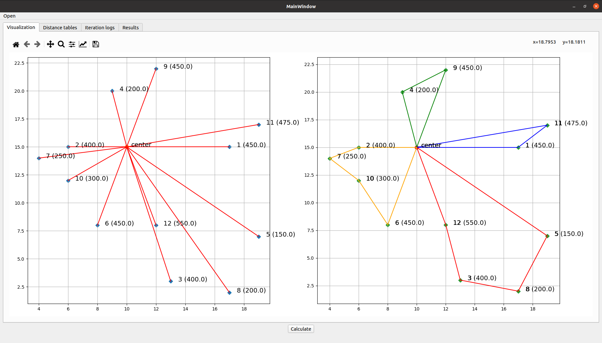

# Vehicle Routing Problem

Wiki: https://en.wikipedia.org/wiki/Vehicle_routing_problem

```
python3 -m venv env
source env/bin/activate
pip install -r requirements.txt
python3 main.py
```

Then open any file from "samples" directory using "open" button on the app UI.




